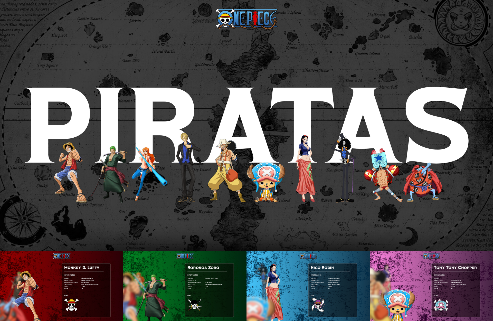

# 🏴‍☠️ One Piece Paralax Carossel

Este projeto foi baseado em em projeto da DIO sobre o Spyder-Verso. O projeto consiste em uma aplicação interativa inspirada no universo do One Piece, usando as principais stacks front-end: React, Next.js 13, a biblioteca Framer Motion, Sass e TypeScript para criar um projeto visual incrível e de alta performance.

Criei uma API externa para ter os mesmos desafios, propostos no projeto.

## 🔗 Deploy

- [Link para o site](https://one-piece-next-carossel.vercel.app/)

## 💻 Preview

## ⚙️ Stacks

 CSS - SASS(scss) | JavaScript | Next.js 13 | Typescript | Framer Motion

 ## 📁 DIO - Cursos

A Digital Innovation One (DIO) disponibiliza diversos projetos, trilhas, cursos e bootcamps para seus alunos, sendo possível realizar alguns deles gratuitamente. 

Fiz a versão de configuração do zero para conhecer o Next.js.Este projeto da [DIO](https://web.dio.me/lab/criando-um-carrossel-parallax-do-aranhaverso-com-react-nextjs-13-e-framer-motion/learning/b759ceb8-2fe3-4b14-b5bb-40416d831263), também foi disponibilizado gratuitamente durante uma live. Eles fornecem um tutorial completo no Notion.

[Live da aula](https://www.youtube.com/watch?v=d5HVw12uOpk)

[Github](https://github.com/micheleambrosio/dio-spiderverse)

## 💌 Autora

### Karla Oshikawa

[Linkedin](https://www.linkedin.com/in/karlaoshikawa/) | [Instagram](https://www.instagram.com/karla.oshikawa/)

